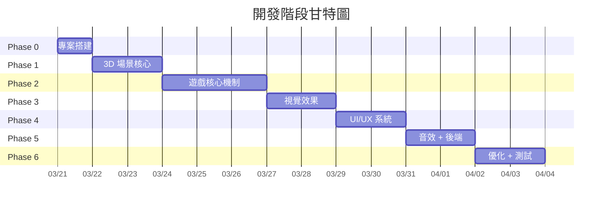
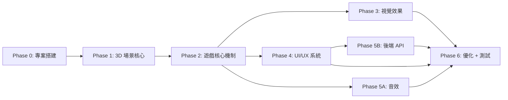

# 🎮 Neon Shape Merge 3D — 程式開發計畫

**文件版本**：v1.0  
**對應 GDD**：v2.0（3D 重製版）  
**技術棧**：TypeScript / Three.js / Rapier3D (WASM) / Vite  
**日期**：2026-03-21

---

## 開發總覽



| 階段 | 名稱 | 核心交付物 | 估計 |
|------|------|-----------|------|
| **Phase 0** | 專案搭建 | Vite + TS + Three.js + Rapier3D 可運行腳手架 | 0.5 天 |
| **Phase 1** | 3D 場景核心 | 攝影機、容器、地板格線、光照、Bloom 後處理 | 1-2 天 |
| **Phase 2** | 遊戲核心機制 | 形狀生成、物理落下、碰撞合成、計分 | 2-3 天 |
| **Phase 3** | 視覺效果 | Material 系統、粒子效果、攝影機震動、格線光流 | 1-2 天 |
| **Phase 4** | UI/UX 系統 | HUD、Overlay 彈窗、瞄準導線、浮動文字 | 1-2 天 |
| **Phase 5** | 音效 + 後端 | 8 種程式合成音效、排行榜 API | 1-2 天 |
| **Phase 6** | 優化 + 測試 | 效能調校、行動裝置適配、QA | 1-2 天 |

**總計估計：7-14 天**

---

## 專案檔案結構

```
Suika3dgame/
├── index.html                 # 入口 HTML（HUD + Overlay DOM 結構）
├── style.css                  # 全域樣式（HUD / Overlay / Overlay 動畫）
├── vite.config.ts             # Vite 設定（WASM 處理）
├── tsconfig.json              # TypeScript 設定
├── package.json               # 依賴管理
│
├── src/
│   ├── main.ts                # 進入點（WASM init → Game.init）
│   ├── game.ts                # 主控制器（遊戲狀態管理 + 主循環）
│   ├── constants.ts           # 全域常數（容器尺寸、物理參數、時間常數）
│   ├── types.ts               # TypeScript 型別定義
│   │
│   ├── core/
│   │   ├── scene.ts           # SceneManager（Scene + Camera + Renderer）
│   │   └── input.ts           # InputManager（滑鼠/觸控 + Raycaster）
│   │
│   ├── systems/
│   │   ├── physics.ts         # PhysicsSystem（Rapier3D World 封裝）
│   │   ├── merge.ts           # MergeSystem（碰撞合成邏輯 + 計分）
│   │   ├── particles.ts       # ParticleSystem（Ring/Shard/Dot 3D 粒子）
│   │   ├── aim-guide.ts       # AimGuide（3D 瞄準線 + 幽靈形狀）
│   │   └── grid-flow.ts       # GridFlow（地板格線光流效果）
│   │
│   ├── rendering/
│   │   ├── materials.ts       # MaterialFactory（霓虹 Material 快取）
│   │   ├── geometries.ts      # GeometryFactory（9 種 Geometry 快取）
│   │   ├── post-processing.ts # PostProcessing（EffectComposer + Bloom）
│   │   └── shape-mesh.ts      # createNeonMesh()（形狀 Mesh 建立）
│   │
│   ├── audio/
│   │   └── audio.ts           # AudioManager（8 種程式合成音效）
│   │
│   ├── ui/
│   │   ├── hud.ts             # HUD（分數 / NEXT 預覽 / Evolution Bar）
│   │   └── overlays.ts        # OverlayManager（難度 / GameOver / 排行 / 設定）
│   │
│   └── utils/
│       ├── pool.ts            # ObjectPool（通用物件池）
│       └── math.ts            # 數學工具（clamp / lerp / random）
│
├── server.js                  # Express 後端（排行榜 API）
│
└── docs/gdd/                  # GDD 文件（已完成）
```

---

## Phase 0：專案搭建

### 目標
建立 Vite + TypeScript + Three.js + Rapier3D 可運行的空白項目。

### 步驟

#### 0.1 初始化 Vite 專案
```bash
npx -y create-vite@latest ./ --template vanilla-ts
npm install three @types/three
npm install @dimforge/rapier3d-compat
npm install --save-dev vite
```

#### 0.2 Vite 配置

```typescript
// vite.config.ts
import { defineConfig } from 'vite';
import path from 'path';

export default defineConfig({
  resolve: {
    alias: { '@': path.resolve(__dirname, 'src') }
  },
  optimizeDeps: {
    exclude: ['@dimforge/rapier3d-compat']
  }
});
```

#### 0.3 tsconfig.json 路徑別名
```json
{
  "compilerOptions": {
    "paths": { "@/*": ["./src/*"] },
    "moduleResolution": "bundler",
    "target": "ES2020",
    "strict": true
  }
}
```

#### 0.4 驗證檢查點
- [ ] `npm run dev` 可啟動
- [ ] `import * as THREE from 'three'` 無錯誤
- [ ] `import RAPIER from '@dimforge/rapier3d-compat'` → `await RAPIER.init()` 成功

---

## Phase 1：3D 場景核心

### 目標
建立完整的 3D 遊戲場景：攝影機、容器、地板、光照、後處理。啟動後可看到霓虹風格的空容器。

### 依賴
- Phase 0 完成

### 步驟

#### 1.1 `src/constants.ts` — 全域常數

定義 GDD 第 2/3/8 章中所有常數：

| 常數組 | 內容 |
|--------|------|
| 容器 | `CONTAINER_WIDTH=10`, `HEIGHT=15`, `DEPTH=10` |
| 物理 | `GRAVITY_Y=-20`, `TIMESTEP=1/60` |
| 遊戲 | `GAME_OVER_LINE_Y=13`, `DROP_COOLDOWN=450` |
| Bloom | `STRENGTH=0.8`, `RADIUS=0.4`, `THRESHOLD=0.6` |

#### 1.2 `src/core/scene.ts` — SceneManager

| 職責 | 規格（GDD Ch.2 / Ch.3） |
|------|--------------------------|
| Scene | `background=0x0a0a0f`, `fog=FogExp2(0x0a0a0f, 0.02)` |
| Camera | `PerspectiveCamera(45, aspect, 0.1, 100)`, pos=(0,18,20), lookAt=(0,5,0) |
| Renderer | `WebGLRenderer({ antialias, powerPreference })`, toneMapping=ACES |
| CSS2DRenderer | 用於場景內浮動 UI |
| Resize | `camera.aspect` + `renderer/composer.setSize` |

#### 1.3 `src/rendering/post-processing.ts` — 後處理

```
RenderPass → UnrealBloomPass(strength=0.8, radius=0.4, threshold=0.6) → OutputPass
```

#### 1.4 環境建構（在 `game.ts` init 中調用）

| 元素 | 實作 | GDD 參考 |
|------|------|---------|
| 地板 | `PlaneGeometry(30,30)` + `GridHelper(30,30,0x00FFFF)` | Ch.4 §4.4 |
| 容器線框 | `EdgesGeometry(BoxGeometry)` + `LineSegments` 青色 | Ch.4 §4.4 |
| 光照 | Ambient + 3× PointLight | Ch.3 §3.3 |
| GameOver 面 | `PlaneGeometry` 紅色半透明 at Y=13 | Ch.4 §4.4 |

#### 1.5 `src/systems/physics.ts` — PhysicsSystem

| 職責 | 規格（GDD Ch.3 §3.2） |
|------|--------------------------|
| init | `await RAPIER.init()` → `new World(gravity)` |
| 建立容器 | 5 個 Static Cuboid（地板+四牆） |
| step | `world.step()` 每幀呼叫 |
| sync | Body position/quaternion → Mesh position/quaternion |
| cleanup | `world.free()` 遊戲結束時 |

#### 1.6 驗證檢查點
- [ ] 啟動後可見：深黑背景 + 青色格線地板 + 容器線框 + 光照
- [ ] Bloom 泛光讓青色容器線條有 Glow 效果
- [ ] 攝影機角度正確（俯視 ~30°）
- [ ] 視窗 resize 不變形

---

## Phase 2：遊戲核心機制

### 目標
實現完整的遊戲循環：形狀投放 → 物理落下 → 碰撞合成 → 計分。

### 依賴
- Phase 1 完成

### 步驟

#### 2.1 `src/rendering/geometries.ts` — GeometryFactory

快取 9 種 Geometry（GDD Ch.2 §2.4）：

| Lv | Geometry | 參數 |
|----|----------|------|
| 0 | `TetrahedronGeometry(r)` | detail=0 |
| 1 | `SphereGeometry(r, 16, 12)` | — |
| 2 | `BoxGeometry(s,s,s)` | s=r×1.4 |
| 3 | `DodecahedronGeometry(r)` | detail=0 |
| 4 | `IcosahedronGeometry(r)` | detail=0 |
| 5 | `SphereGeometry(r, 24, 16)` | — |
| 6 | `OctahedronGeometry(r)` | detail=0 |
| 7 | 自訂 `BufferGeometry` | 截角二十面體 32 面 |
| 8 | `SphereGeometry(r, 32, 24)` | — |

#### 2.2 `src/rendering/materials.ts` — MaterialFactory

每個形狀等級建立並快取（GDD Ch.4 §4.3）：

```typescript
interface ShapeMaterials {
  main: THREE.MeshPhysicalMaterial;   // 半透明主體
  edge: THREE.LineBasicMaterial;       // 稜線光暈
}
```

#### 2.3 `src/rendering/shape-mesh.ts` — createNeonMesh

組合 Geometry + Material + EdgesGeometry → 完整 3D 形狀 Mesh。

#### 2.4 `src/core/input.ts` — InputManager

| 功能 | 實作（GDD Ch.3 §3.5） |
|------|--------------------------|
| Raycaster | 螢幕座標 → 投影到 Y=14 投放平面 |
| Clamp | X 軸限制在 ±(5 - radius - 0.08) |
| 事件 | `pointermove` / `pointerdown`（統一觸控+滑鼠） |

#### 2.5 形狀投放機制（`game.ts` handleDrop）

流程（GDD Ch.6 §6.4）：
1. Raycaster 取得 worldX
2. Clamp X → 建立 Rapier3D Dynamic Body + Three.js Mesh
3. `canDrop=false` → 450ms 後恢復
4. currentLevel ↔ nextLevel 輪替

#### 2.6 `src/systems/merge.ts` — MergeSystem

碰撞合成邏輯（GDD Ch.2 §2.4 + Ch.6 §6.1）：

```
每幀遍歷 contactPairs：
  → 過濾非形狀 / 不同等級 / 已在 cooldown
  → 移除兩舊 Body+Mesh
  → 在中點生成新等級 Body+Mesh
  → score += shapes[newLevel].score
  → comboCount++ → setTimeout 重置
  → 觸發：粒子、音效、震動、浮動文字
```

#### 2.7 Game Over 判定（`game.ts`）

三重條件檢查（GDD Ch.6 §6.2）：
1. `body.translation().y > 13`
2. 是遊戲形狀
3. `linvel().length() < 0.3`
→ 持續 1500ms → 觸發 Game Over

#### 2.8 驗證檢查點
- [ ] 點擊可投放 3D 形狀，正確落入容器
- [ ] 相同等級碰撞 → 合成升級（Lv.0+Lv.0→Lv.1）
- [ ] 不同等級碰撞 → 不合成
- [ ] Lv.8+Lv.8 → 得分無新形狀
- [ ] 形狀堆疊穩定不穿透
- [ ] Game Over 正確觸發
- [ ] 分數累計正確

---

## Phase 3：視覺效果

### 目標
實現合成粒子、攝影機震動、形狀自轉、格線光流效果。

### 依賴
- Phase 2 完成

### 步驟

#### 3.1 `src/systems/particles.ts` — ParticleSystem

三種 3D 粒子（GDD Ch.8 §8.1.1）：

| 粒子 | 技術 | 關鍵參數 |
|------|------|---------|
| Ring | Mesh + scale 動畫 | 從 0.1 擴至 radius×3.5 |
| Shard | InstancedMesh（小型多面體） | 8+level×2 個，3D 飛散+旋轉 |
| Dot | THREE.Points + PointsMaterial | 16+level×3 個，AdditiveBlending |

#### 3.2 攝影機震動（game.ts）

GDD Ch.5 §5.5：`camera.position` 微偏移，×0.85 衰減。

#### 3.3 形狀自轉動畫

GDD Ch.4 §4.3：靜止形狀 0.002~0.008 rad/幀隨機軸旋轉，碰撞中由物理接管。

#### 3.4 `src/systems/grid-flow.ts` — 格線光流

GDD Ch.8 §8.1.2：
- THREE.Sprite + CanvasTexture（4 層漸層光點）
- 最大 20 個同時存在
- 60%水平/40%垂直 流動
- AdditiveBlending + 閃爍 alpha

#### 3.5 `src/utils/pool.ts` — ObjectPool

通用池：`acquire()` / `release()` / `drain()`

#### 3.6 驗證檢查點
- [ ] 合成時 Ring 環形擴散正確
- [ ] Shard 碎片 3D 飛散+旋轉+縮小
- [ ] Dot 光點飛散+重力+AdditiveBlending 發光
- [ ] 攝影機震動適度，不影響操作
- [ ] 格線光流沿地板格線流動

---

## Phase 4：UI/UX 系統

### 目標
完成 HUD、所有 Overlay 彈窗、瞄準導線、浮動文字回饋。

### 依賴
- Phase 2 完成（可與 Phase 3 並行）

### 步驟

#### 4.1 `index.html` + `style.css` — DOM 結構

```
#game-wrapper
  #hud（分數 + 按鈕 + NEXT 預覽）
  #canvas-container（Three.js Canvas 掛載點）
  #evolution-bar
  #overlay-difficulty
  #overlay-gameover
  #overlay-leaderboard
  #overlay-settings
```

#### 4.2 `src/ui/hud.ts` — HUD

| 元素 | 實作 | GDD 參考 |
|------|------|---------|
| SCORE | DOM 更新 | Ch.5 §5.2 |
| NEXT 預覽 | 小型 WebGLRenderer 3D 旋轉預覽 | Ch.5 §5.2 |
| Evolution Bar | 預生成 PNG 或小 Canvas | Ch.5 §5.2 |

#### 4.3 `src/ui/overlays.ts` — OverlayManager

4 個 Overlay（GDD Ch.5 §5.3）：難度選擇、Game Over、排行榜、設定。  
模糊遮罩：CSS `backdrop-filter: blur(6px)`。

#### 4.4 `src/systems/aim-guide.ts` — 瞄準導線

半透明柱體 + 幽靈形狀（alpha=0.35），跟隨 Input X。

#### 4.5 浮動分數 / COMBO 文字

CSS2DObject + CSS `@keyframes` 上飄淡出動畫。

#### 4.6 驗證檢查點
- [ ] HUD 分數即時更新，NEXT 3D 預覽正確
- [ ] 4 個 Overlay 正常開關+前景狀態保存
- [ ] 瞄準線跟隨滑鼠/觸控
- [ ] 浮動分數定位正確，動畫流暢

---

## Phase 5：音效 + 後端

### 目標
實現 8 種程式合成音效系統與排行榜後端。

### 依賴
- Phase 2（音效）、Phase 4（排行榜 UI）

### 步驟

#### 5.1 `src/audio/audio.ts` — AudioManager

GDD Ch.7 全章：懶初始化 AudioContext、投落音效、8 種合成音效工廠、動態音調、DynamicsCompressor。

#### 5.2 `server.js` — Express 後端

GDD Ch.8 §8.2：POST/GET `/api/scores`，SQLite WAL，Port 7860。

```bash
npm install express better-sqlite3
```

#### 5.3 驗證檢查點
- [ ] 投落/合成音效正確播放，8 種可切換
- [ ] POST/GET API 正常，排行榜 UI 顯示資料

---

## Phase 6：優化 + 測試 + 部署

### 目標
效能優化、行動裝置適配、完整 QA。

### 步驟

#### 6.1 效能優化

| 優化項 | 技術 | 目標 |
|--------|------|------|
| Draw Calls | InstancedMesh 合併粒子 | <100（桌機）|
| Memory | Geometry/Material dispose | 20 分鐘無洩漏 |
| Pool | Mesh/Particle/Text 物件池 | 減少 GC |
| Bloom | 條件式降級 | 行動裝置可關閉 |
| pixelRatio | `min(dpr, 2)` | 避免過高渲染 |

#### 6.2 行動裝置適配

Viewport meta、touch-action:none、pixelRatio 限制、行動降級。

#### 6.3 功能 QA

依照 GDD Ch.9 §9.2 測試清單（85+ 項）逐一驗證。

#### 6.4 效能基準測試

| 指標 | 桌機 | 行動 |
|------|------|------|
| FPS | 60 | ≥30 |
| Draw Calls | <100 | <50 |
| 三角形 | <50K | <20K |
| WASM 載入 | <2s | <3s |

---

## 依賴關係圖



> **可並行**：Phase 3 / 4 / 5A 可在 Phase 2 完成後並行開發。

---

## npm 依賴清單

| 類型 | 套件 | 用途 |
|------|------|------|
| dep | `three` ^0.170 | 3D 渲染 |
| dep | `@dimforge/rapier3d-compat` ^0.14 | 3D 物理 (WASM) |
| dep | `express` ^4.21 | HTTP 伺服器 |
| dep | `better-sqlite3` ^11.0 | SQLite |
| dev | `vite` ^6.0 | 建構工具 |
| dev | `typescript` ^5.7 | 編譯 |
| dev | `@types/three` ^0.170 | 型別 |
| dev | `@types/better-sqlite3` ^7.6 | 型別 |

---

## 風險與緩解

| 風險 | 機率 | 緩解策略 |
|------|------|---------|
| Lv.7 截角二十面體 Geometry 建立困難 | 中 | 可降級為 `IcosahedronGeometry(r, 1)` |
| Rapier3D WASM 載入慢 | 低 | Loading 畫面 + 錯誤提示 |
| Bloom 行動裝置效能不佳 | 中 | 自動偵測並關閉 Bloom |
| 球形碰撞堆疊不穩定 | 低 | 調整 damping / solver iterations |
| CSS2DRenderer 效能 | 低 | 限制同時數量 + 物件池 |
